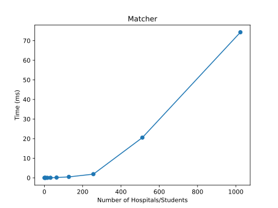
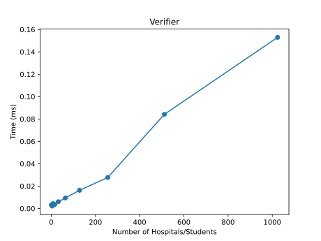

# Programming Assignment 1: Matching and Verifying

COP4533 - Algorithm Abstraction and Design

Yash Narayan - TODO

Daniel Li - 99157575

This assignment implements a Gale-Shapley matcher and verifier.
The main program is `gs.py`.
Example files are in the `examples` directory,
see `examples/example.in` and `examples/example.out`.

Requirements:

* A recent version of Python (tested with Python 3.14.2)

## Matcher

The matcher is invoked with one argument, the input file containing the
preference lists. The resulting matching is printed to stdout.

The input format is as follows:

* First line is a positive integer `n` of hospitals/students.
* Next `n` lines are the preference lists for the hospitals.
  Each preference list is a space-separated sequence of integers,
  each referring to a student numbered 1 to `n`.
* Next `n` lines are the preference lists for the students.

The output format is as follows: each line is a pair `h s`, where `h` is the
number of the hospital and `s` is the number of the student.

Example:

```
python3 gs.py examples/example.in
```

## Verifier

The verifier is invoked with two arguments: the first is the input file
containing the preference lists, and the second is the file to verify.

Example:

```
python3 gs.py examples/example.in examples/example.out
```

The output can be `INVALID` with a reason if the matching is invalid,
`UNSTABLE` with a reason if there is an instability in the matching,
or `VALID STABLE` if the matching is stable.

## Scalability

Requirements:

* [Matplotlib](https://matplotlib.org) (tested with Matplotlib 3.10.8)

The stress tester runs the matcher and verifier with increasing input size `n`.
It generates random preference lists for `n` hospitals and `n` students,
runs the matcher and measures the execution time, then feeds the output to
the verifier and measures the execution time. The stress tester then
generates the matcher and verifier graphs using Matplotlib.

Results:





The matcher implementation appears to be super-linear (probably quadratic) on
the size of the input. The verifier appears to be linear.

To run the stress tester (note that this will overwrite
`stress-matcher.svg` and `stress-verifier.svg`):

```
python3 stress.py
```
